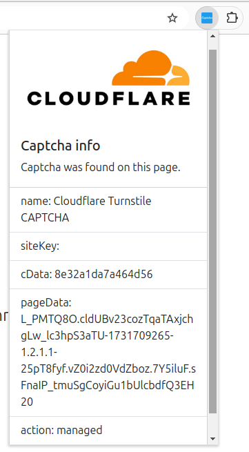
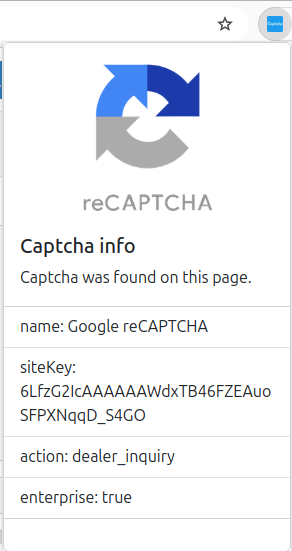

## Table of contents

* [General info](#general-info)
* [Tools](#tools)
* [Current features](#current-features)
* [Setup](#setup)
* [Screenshot](#screenshots)

## General info

Chrome extension for captcha key parsing.

## Tools

- Typescript v5.6.3
- Bootstrap v5.2
- Chrome Extensions APIs (Manifest v3)

## Current features

- Ability to parse google captcha key
- Ability to parse cloudflare captcha key

## Setup

### Clone the repository
```
git clone git@github.com:RomaLuck/CaptchaKeyParser.git
```

Install Packages

```
npm install
```

Build the project

```
npm run build
```

## Screenshots


